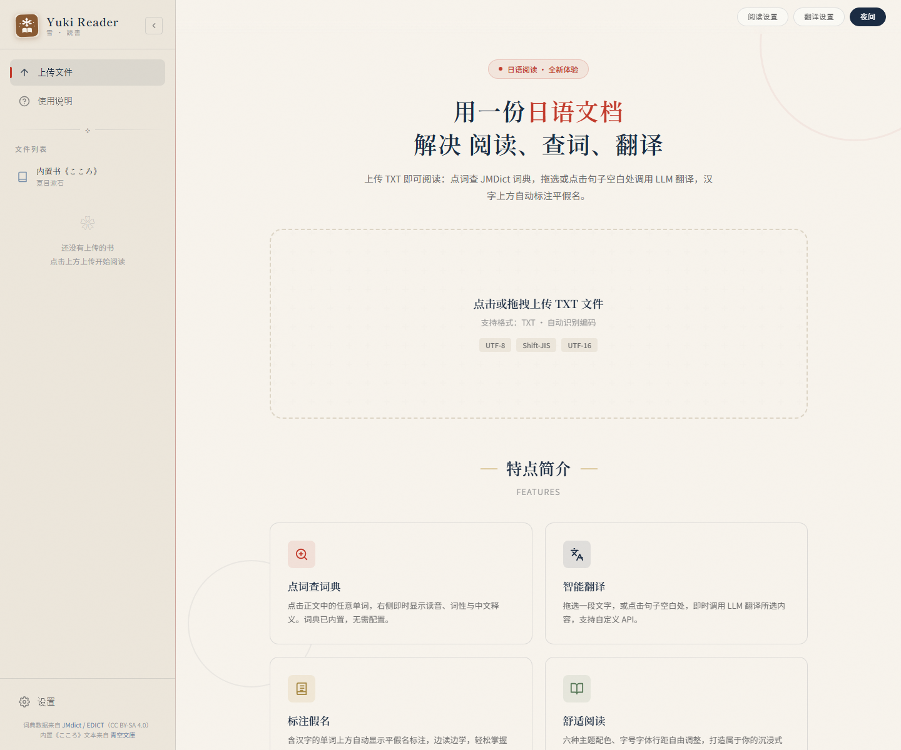

# Yuki Reader — 日语阅读 · 查词 · 翻译

> 雪 · 読書 —— 让日语文档变得好读、好查、好译

Yuki Reader 是一个个人日语阅读应用：上传 TXT 或打开内置书《こころ》，点词即可查 JMDict 词典，点句或拖选即可调用你自己的大模型翻译，汉字上方自动标注平假名。首页为和纸风工作台，支持右上角「日间 / 夜间」切换。

[](https://github.com/Yukino-biter/Yuki-Reader/actions/workflows/ci.yml)



## 功能特点

| 功能 | 说明 |
| --- | --- |
| 点词查词典 | 点击正文中的任意单词，右侧即时显示读音、词性与中文释义（JMDict 词典已内置，无需配置） |
| 智能翻译 | 拖选一段文字，或点击句子空白处，调用你自带的 LLM 翻译（BYOK） |
| 分类翻译 | 自动识别书籍类别（文学 / 轻小说 / 其他）切换翻译风格，可在阅读页顶栏手动修改 |
| 标注假名 | 含汉字的单词上方自动显示平假名，可在阅读设置中开关 |
| 舒适阅读 | 六种主题、字号、字体、行距、页面宽度自由调整，支持日间 / 夜间 |

## 操作说明

1. **点词查词典** — 点击正文中的任意单词，右侧显示读音、词性与中文释义。词典已内置，无需配置。
2. **拖选翻译** — 拖选一段文字，调用 LLM 翻译所选内容。
3. **点句翻译** — 点击句子的空白处（非文字区域），翻译整句。

> API 需要自己配置；分词无需配置，打开书即自动完成。

## 翻译设置（BYOK）

翻译功能使用你自己的大模型 API Key（BYOK，Bring Your Own Key）：

1. 点击右上角「翻译设置」，或侧栏底部「设置」→「翻译设置」。
2. 选择厂商（会自动填入 Base URL 和默认模型），或手动填写。
3. 填入 API Key，点「测试连接」验证，再保存。

内置厂商与默认模型：

| 厂商 | 默认模型 | Base URL |
| --- | --- | --- |
| DeepSeek | `deepseek-v4-flash` | https://api.deepseek.com |
| Kimi (Moonshot) | `kimi2.6` | https://api.moonshot.cn/v1 |
| 千问 (Qwen) | `qwen3.7plus` | https://dashscope.aliyuncs.com/compatible-mode/v1 |
| GLM (智谱) | `glm-4-flash` | https://open.bigmodel.cn/api/paas/v4 |
| MiMo | `mimo-v2.5` | https://api.xiaomimimo.com/v1 |
| OpenAI | `gpt-4o-mini` | https://api.openai.com/v1 |
| OpenRouter | `openai/gpt-4o-mini` | https://openrouter.ai/api/v1 |
| 自定义 | — | 任意 OpenAI 兼容接口 |

隐私说明：API Key 只保存在浏览器本地（localStorage），请求由后端 `/api/chat` 转发，后端不存储 Key、不打日志。

## 快速开始

### 方式一：本地一键启动

前置：JDK 17、Node.js 20+（仅首次构建需要）。

```powershell
# 1. 构建前端并打包
npm --prefix frontend install
npm --prefix frontend run build
mvn -f backend\pom.xml clean package

# 2. 启动（含本地假 LLM 上游，方便先体验翻译流程）
powershell -ExecutionPolicy Bypass -File scripts\start-local.ps1
# 打开 http://localhost:8080
```

停止服务：`powershell -ExecutionPolicy Bypass -File scripts\stop-local.ps1`

### 方式二：直接运行 jar

```powershell
$env:YUKI_DB_PATH = 'backend\data\yuki.db'
$env:YUKI_JMDICT_XML = 'backend\data\jmdict\JMdict_e'
java -jar backend\target\yuki-reader.jar
```

首次启动会自动把 JMDict 词典导入 SQLite；词典 XML 需提前下载（一次性）：

```powershell
powershell -ExecutionPolicy Bypass -File scripts\download-jmdict.ps1
```

### 开发模式（热更新）

```powershell
mvn -f backend\pom.xml spring-boot:run   # 后端 http://localhost:8080
npm --prefix frontend run dev            # 前端 http://localhost:5173，/api 代理到 8080
```

## 数据与版权

- 词典：JMDict / EDICT（CC BY-SA 4.0，[官方页](https://www.edrdg.org/jmdict/)）
- 内置书：《こころ》（夏目漱石，青空文庫公有领域文本，[原文](https://www.aozora.gr.jp/cards/000148/files/773_14560.html)）
- 你上传的书只保存在浏览器本地（IndexedDB），不会上传到任何服务器

## 常见问题

- **分词需要配置吗？** 不需要。打开书即自动分词（后端 kuromoji-java），无需任何 Key。
- **翻译为什么需要 API Key？** 翻译调用的是你自己的大模型账号（BYOK），需要去厂商平台申请。
- **支持什么文件格式？** TXT，自动识别 UTF-8 / Shift-JIS / UTF-16 编码。
- **上传的书存哪里？** 浏览器本地 IndexedDB，清理浏览器数据会丢失。
- **怎么切换主题？** 首页右上角「夜间 / 日间」；阅读页还有六套主题和字号、字体、行距、页宽设置。
- **没有网络能查词典吗？** 词典数据内置在服务端，查词不需要联网；翻译则需要你的 API Key 能访问厂商接口。
- **翻译风格能换吗？** 阅读页顶栏的「书籍类别」下拉可随时切换文学 / 轻小说 / 其他，点句翻译还会自动带上前两句作为上下文；未配置 API Key 时自动判定不可用，仍可手动选择。
- **重开书还要等分词吗？** 分词结果会缓存在浏览器本地（IndexedDB），第二次打开同一本书直接渲染；删除书籍时会一并清理。
- **译文会重复请求吗？** 翻译结果按（模型 + 类别 + 术语表 + 提示词版本 + 原文）缓存在本地，同样的句子重复翻译零延迟零消耗；侧栏「历史」可回看最近 20 条。
- **人名译名总是漂移怎么办？** 顶栏「术语」打开术语表，把「原文 → 固定译法」录进去即可，全书翻译自动遵守；翻译卡上的「+ 术语」按钮会预填原文里的片假名候选。
- **翻译是流式的吗？** 是。整句 / 拖选翻译逐字上屏（后端 `/api/chat/stream` 原样中继上游 SSE），长段落不用干等。

## 开发者

技术栈：React 18 + Vite 5（前端）· Spring Boot 3.5 + SQLite + kuromoji-java（后端）· Maven 单 fat jar 部署。

- 前端测试：`npm --prefix frontend test`（59 用例）
- 后端测试：`mvn -f backend\pom.xml test`（38 用例）
- 设计规格与实现细节：`docs/superpowers/`

---

愿每一次阅读，都是一场旅途 ❤
